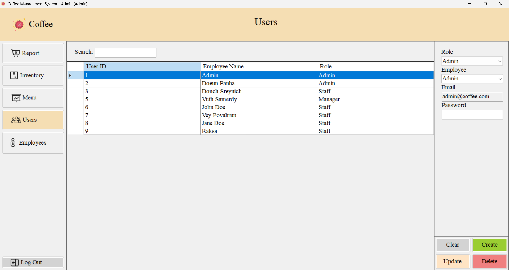
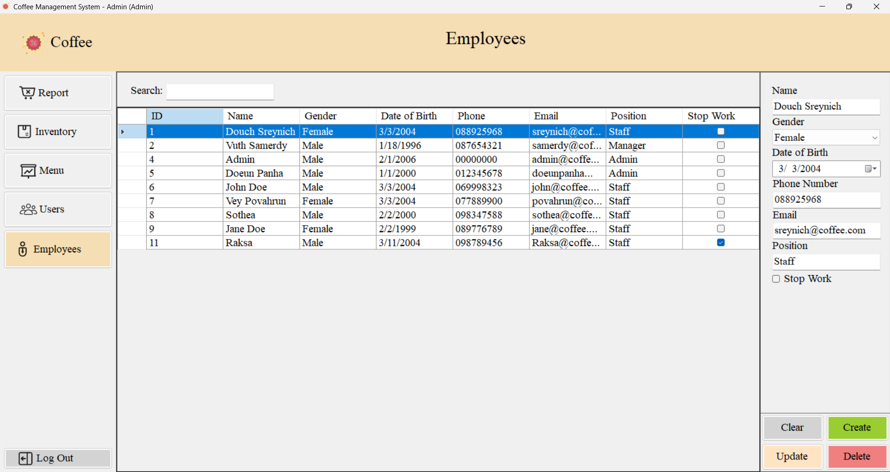
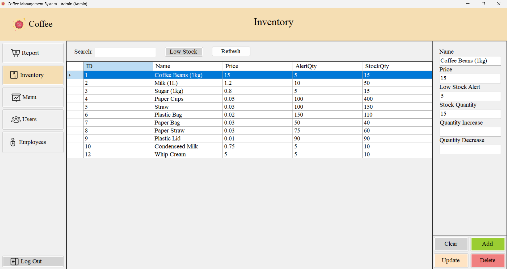
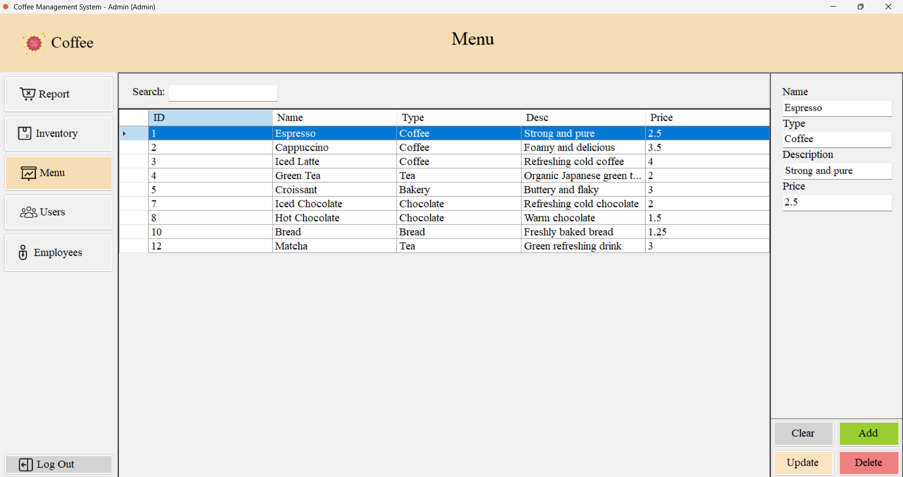
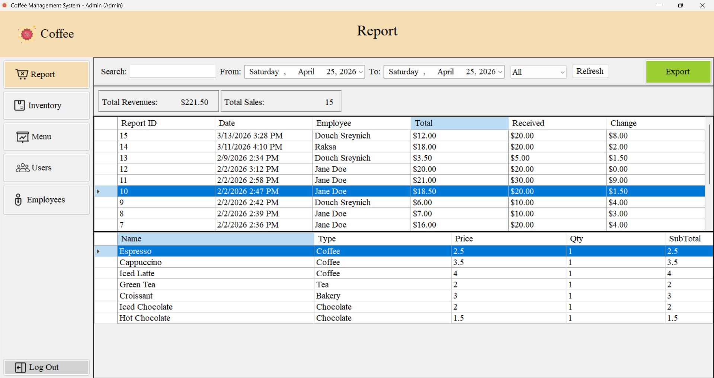
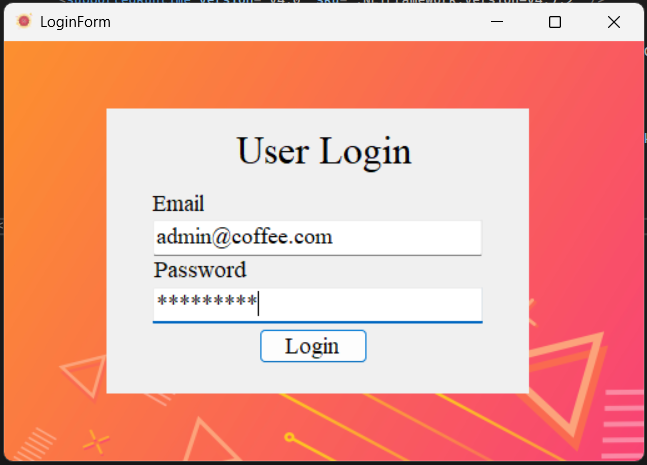
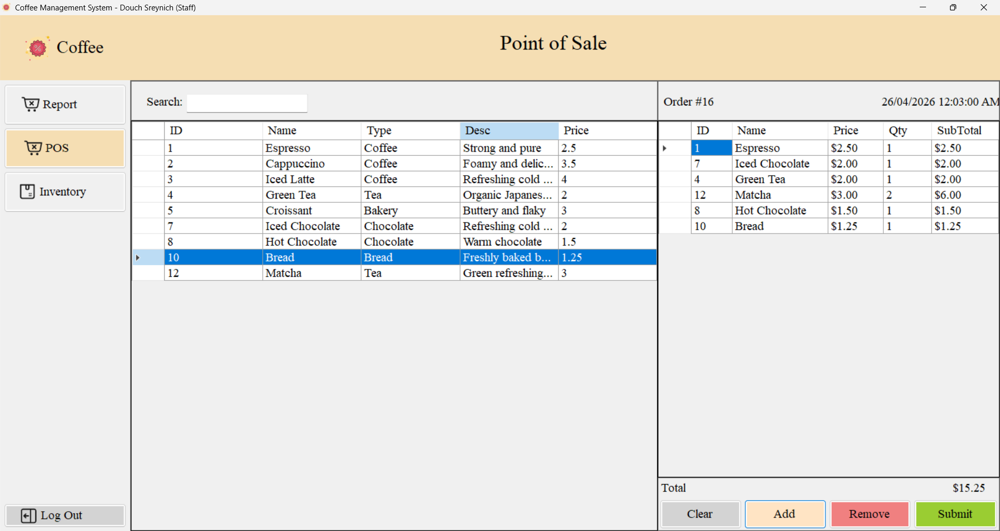
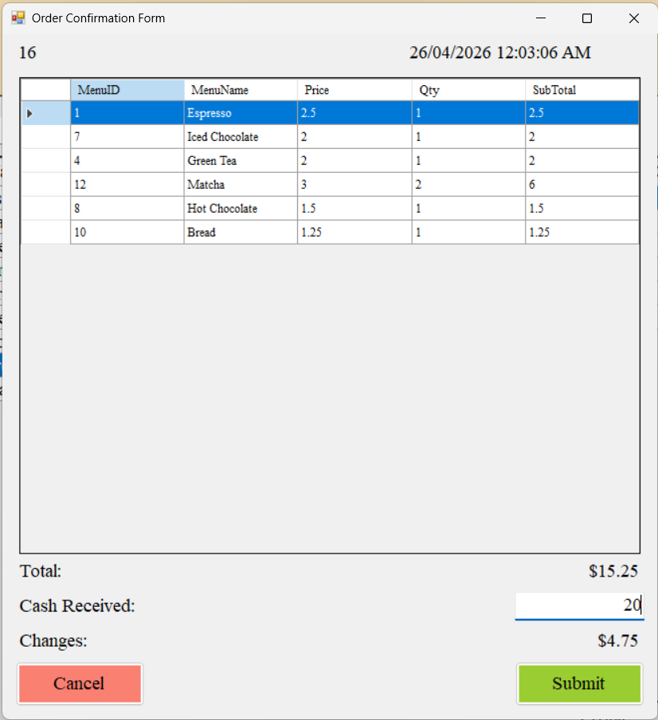
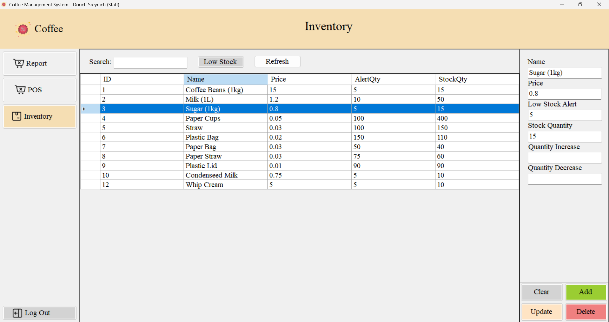

# ☕ Coffee Management System

A robust and user-friendly management system for coffee shops, built using .NET Framework and SQL Server. This application provides comprehensive tools for both administrative management and staff operations.

---

## 📸 System Screenshots

### 👔 Administrative Interface
| Admin Dashboard | Employee Management | Inventory Control |
| :---: | :---: | :---: |
|  |  |  |

| Menu Management | Sales Reports | System Login |
| :---: | :---: | :---: |
|  |  |  |

### ☕ Staff & POS Interface
| POS Terminal | Order Confirmation | Staff Inventory |
| :---: | :---: | :---: |
|  |  |  |

---

## ✨ Key Features

- **👔 Admin Dashboard**: Full CRUD management for employees, inventory, and menu items with secure role-based access control.
- **📊 Reporting**: Generate real-time sales to track business growth and staff efficiency.
- **☕ Intuitive POS**: A streamlined interface for staff to process orders quickly with real-time status tracking.
- **🔐 Secure Access**: Integrated authentication system featuring a `PasswordHelper` for secure user management.

---

## 📁 Project Structure

```text
CoffeeManagementSystem/
├── 📁 Forms/              # Main window containers (Login, MainForm)
├── 📁 Models/             # Core Logic & Data Access Layer
│   ├── 📁 Abstract Classes # Base logic (e.g., APerson.cs for OOP inheritance)
│   ├── 📁 Classes          # Entity logic (Employee, Inventory, DatabaseHelper)
│   ├── 📁 Enum             # Strongly typed constants (Gender.cs)
│   └── 📁 Interfaces       # Contract-based design (ISaleable.cs)
├── 📁 UserControls/       # Modular UI Components
│   ├── 📁 AdminUserControls    # Admin-only views (Inventory, Reports, Users)
│   └── 📁 EmployeeUserControl  # Staff-specific views (POSControl)
├── ⚙️ App.config          # Database connection strings
└── 📜 Program.cs          # Application entry point

```

---

## 🚀 Setup & Installation

Follow these steps to get your local development environment running.

### 📋 Prerequisites
* **Visual Studio** (2019 or later recommended)
* **.NET Framework 4.7.2**
* **SQL Server** 

### 🛠️ Installation Steps

1. **Clone the Repository**
   ```bash
   git clone https://github.com/Doeun-Panha/CoffeeManagementSystem.git

2. **Database Configuration**
   Open `App.config` and update the `connectionString` to point to your local SQL Server instance:
   ```xml
   <connectionStrings>
       <add name="CoffeeDB" 
            connectionString="Server=YOUR_SERVER_NAME;Database=CoffeeManagementSystem;Integrated Security=True;" 
            providerName="System.Data.SqlClient" />
   </connectionStrings>

3. **Build and Run**
   - Open `CoffeeManagementSystem.sln` in **Visual Studio**.
   - Right-click the Solution and select **Restore NuGet Packages** to install dependencies.
   - Press `F5` or click the **Start** button to compile and launch the application.

---

## 👨‍💻 Developed By

**Doeun Panha** *IT Graduate (RUPP) & B.Ed in English (IFL)* *Aspiring Developer*

---

## 📄 License

This project is open-source and available under the [MIT License](LICENSE).
